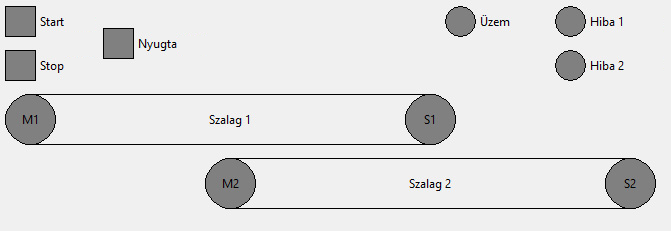

# Szalag 1v0

### Elvárt működés:
* Szalag rendszer indítása *Start* gomb hatására történik (*M1* és *M2* bekapcsol).
* A működést az *Uzem* visszajelző jelezze.
* A *Stop* gomb hatására az *M1* szalag még 5s-ig működjön és a megállást követően az *M2*-as még további 5s-ig működjön.
* Ha *M1* szalag hiba miatt leáll (esetleg el sem indul), azonnal meg kell állítani és az M2-as késleltetve 5s-után. A hibát a Nyugta gomb megnyomásával lehessen nyugtázni. 
* Ha az *M2*-as szalag hiba miatt leáll (esetleg el sem indul), az összes szalagot azonnal meg kell állítani. A hibát a Nyugta gomb megnyomásával lehessen nyugtázni.
* A hibás szalagot villogó hibajelzéssel kell jelezni

A működésről az S1 és S2 ad visszajelzést, a szalag indítása után csak 2,5s eltelte után kell figyelembe venni!

### Kiegészítés:
Az üzem visszajelző a szalagok működése alatt világítson a leállítási folyamat alatt villogjon
