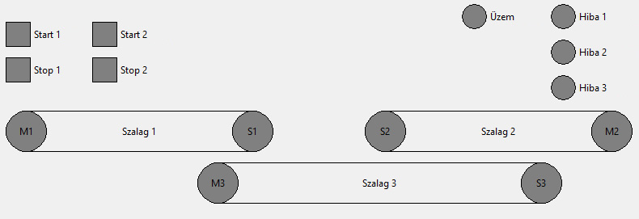

# Szalag 1v0

### Elvárt működés:
* Szalag rendszer indítása a mebfelelő *Start* gomb (*Start1/Start2*) hatására történik, *Szalag1/Szalag2* (*M1/M2*) és *Szalag3* (*M3*) bekapcsol.
* A működést az *Uzem* visszajelző jelezze.
* A megfelelő *Stop* gomb (*Stop1/Stop2*) hatására a *Szalag1/Szalag2* szalag (*M1/M2*) még 5s-ig működjön és a megállást követően a *Szalag3* (*M3*) még további 5s-ig működjön.
* Ha a *Szalag1* szalag (*M1*) hiba miatt leáll (esetleg el sem indul), azonnal meg kell állítani és az M3-as késleltetve 5s-után. Ahibát a megfelelő *Stop* gomb (*Stop1*) megnyomásával lehessen nyugtázni. 
* Ha a *Szalag2* szalag (*M2*) hiba miatt leáll (esetleg el sem indul), azonnal meg kell állítani és az M3-as késleltetve 5s-után. Ahibát a megfelelő *Stop* gomb (*Stop2*) megnyomásával lehessen nyugtázni.
* Ha a *Szalag3* szalag (*M3*) hiba miatt leáll (esetleg el sem indul), az összes szalagot azonnal meg kell állítani. A hibát bármelyik *Stop* gomb (*Stop1*) megnyomásával lehessen nyugtázni.
* A hibás szalagot villogó hibajelzéssel kell jelezni

A működésről az *S1*,*S2* és *S3* ad visszajelzést, a szalag indítása után csak 2,5s eltelte után kell figyelembe venni!

### Kiegészítés:
Az üzem visszajelző a szalagok működése alatt világítson a leállítási folyamat alatt villogjon
